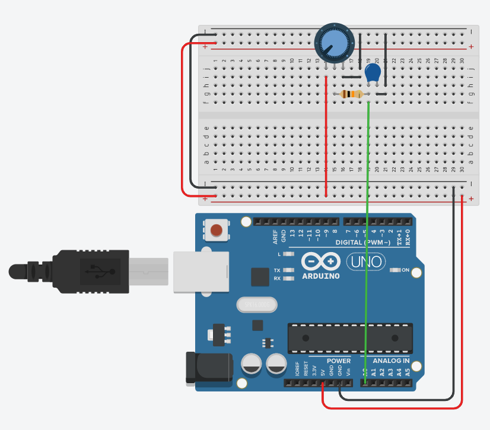

# arduino-smooth-analog-input

## Introduction
A simple base experiment on Arduino by [Loiseau créatif](https://loiseaucreatif.com).  
Code with comments :-)

The goal is to have stable, smooth and precise readings from a potentiometer connected on an analog pin of an Arduino.

I'm not an expert, there's certainly improvements to make.  
This experiment can be a source of inspiration and information for Makers.  
Feel free to interact on GitHub ;-)

At start I watched the YouYube [Live Bar Arduino #8](https://www.youtube.com/watch?v=0zNmt_IKwRg).  
Ubi de Feo talked about Fast Smoothing of Analog Input, and showed his code in action.  
This inspired me, so I took up and analyzed his code, and researched more about this topic.  

Enjoy!

## Methodology

Methods used:
* Running Average algorythm with a FIFO data structure (First In First Out)
* Hardware RC Low Pass Filter (see the schematic image)
* Mapping filtered values

The running average algorythm seems like a good alternative to a simple average to give a smoother output and let the Arduino work on other things.  
But it has one big down side: memory use.

The hardware RC Low Pass Filter on the input analog pin smoothes the signal by killing high frequencies.  
You can use these components and test other values: 100nF(104) Ceramic Condensator + 10KOhm resistor.  
[Online Frequency Calculator](http://www.learningaboutelectronics.com/Articles/Low-pass-filter-calculator.php)

## Additional informations

You can find additional informations here:
* [3 methods to filter noisy Arduino measurements](https://www.megunolink.com/articles/coding/3-methods-filter-noisy-arduino-measurements/)
* Arduino Reference: [analogRead()](https://www.arduino.cc/reference/en/language/functions/analog-io/analogread/)
* Arduino Tutorials: [Smoothing](https://www.arduino.cc/en/tutorial/smoothing)

An additional method called [Hysteresis](https://forum.arduino.cc/index.php?topic=526806.0) can help you to define actions depending on range of readed values.

## Schematic

